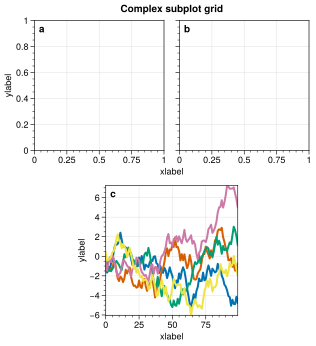
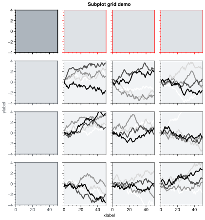
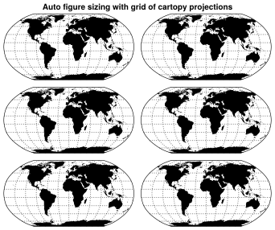
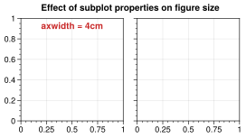
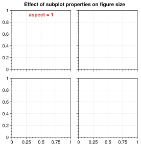
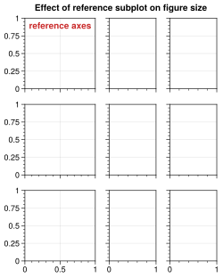
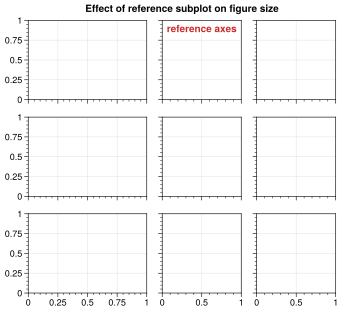
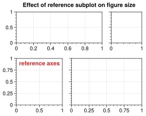

# Julia ProPlot Examples

Here you will find some (most?) of the [ProPlot](https://proplot.readthedocs.io/en/latest/index.html) examples from the documentation, but translated to Julia using [PyCall.jl](https://github.com/JuliaPy/PyCall.jl).

Note you must install ProPlot first. (And probably some other things.)

---

Click on the images below to be directed to the julia code that produced it. 

## Basics

### Figures and subplots

### Formatting subplots

### Changing rc settings

### Subplot grids

## Subplots features

### Automatic figure sizing

## Notes

1. The scoping rules are a bit different between Python and Julia, which require some tweaking for the examples to work.

1. You can't format all the subplots at once with `axs.format` AFAIK, so you have to loop through all axes and format each of them.

1. `f, axs = proplot.subplots()` returns a vector of axes, even if you specify multiple columns, so that you need to reshape (and transpose) the `axs` array to get access to the axes in Cartesian coordinates (i.e., as in `axs[i,j]`).

1. I saved the images to [this gist](https://gist.github.com/briochemc/205e88cd3bfb13dd8c42c539a32afe28) (via `f.savefig("X.svg")`).
